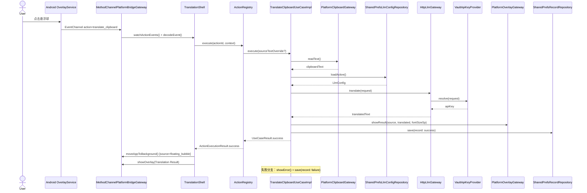
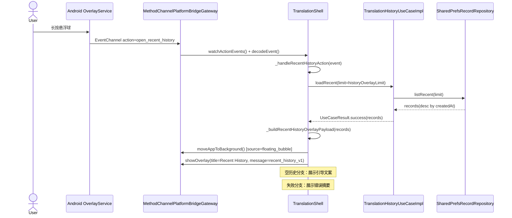
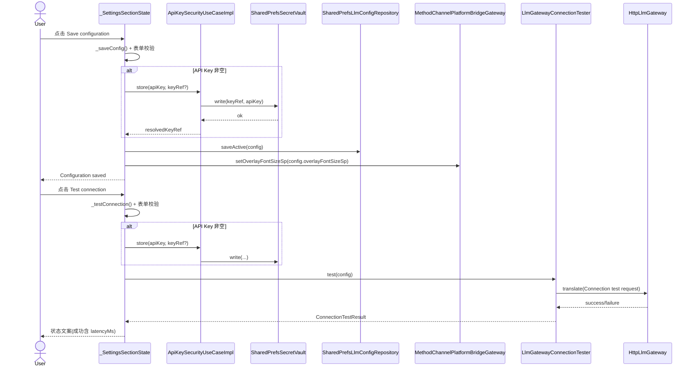
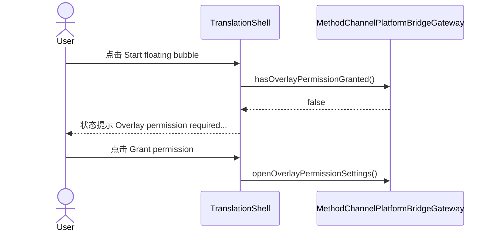
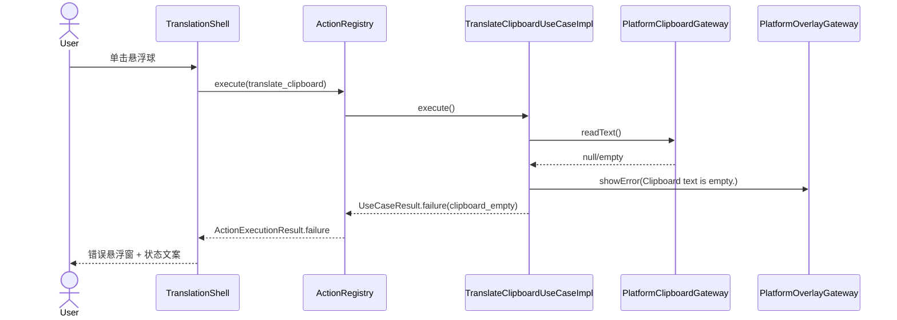
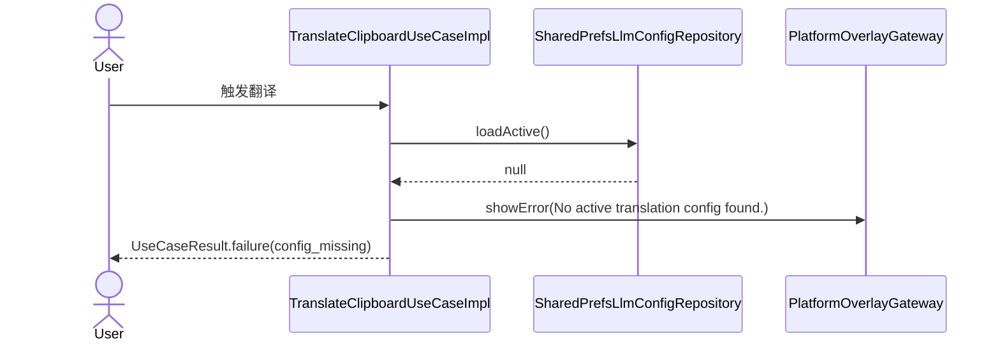
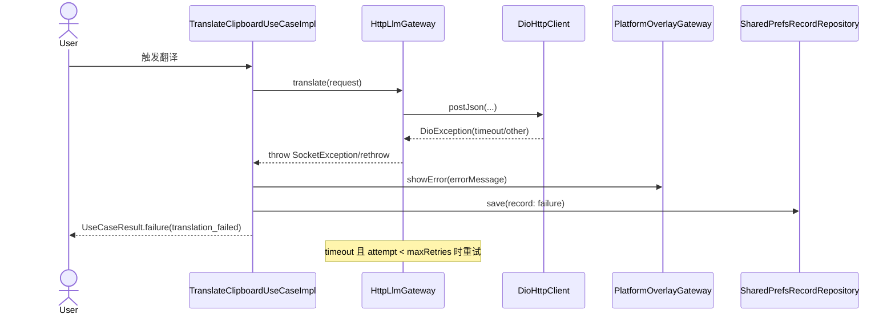
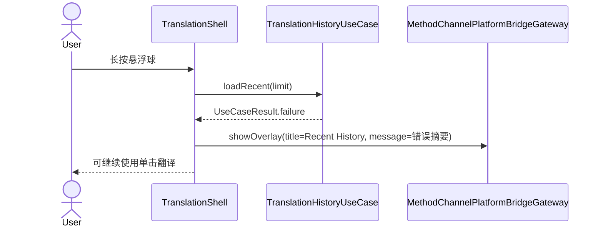

# 安卓翻译 App 设计方案（Flutter + 可扩展悬浮球）

## 1. 项目目标
构建一个基于 Flutter 的安卓翻译 App，满足以下核心能力：

1. 通过 API 接入大模型，并提供参数配置菜单  
2. 提供系统级悬浮球，单击后读取剪切板文本并触发翻译  
3. 将翻译结果以悬浮窗口展示  
4. 翻译记录本地存储，并可便捷查看历史  

设计重点：低耦合、清晰数据流、悬浮球能力可扩展。

---

## 2. 功能范围与拆分

## 2.1 模型接入与配置中心
- 支持 OpenAI 兼容 API（可扩展到多供应商）
- 配置项：
  - Base URL
  - API Key（安全存储）
  - Model
  - Temperature / TopP / MaxTokens / Timeout
  - System Prompt（翻译风格）
- 支持连接测试与默认模板（如中英互译预设）

## 2.2 悬浮球与悬浮窗
- 全局悬浮球常驻（前台服务 + Overlay）
- 单击动作：`translate_clipboard`
- 长按动作：`open_recent_history`（快速查看最近 N 条翻译，默认 3）
- 结果悬浮窗支持：查看原文、查看译文、复制、关闭
- 历史悬浮窗支持：滚动浏览、复制原文、复制译文、关闭
- 悬浮窗字体大小支持配置（12~28sp）并持久化存储
- 历史悬浮窗显示条数支持配置（1~50）并持久化存储

### 2.2.1 悬浮球交互细则（便捷 + 人性化）
- 单击：立即翻译剪切板（保持原有最快路径）
- 长按：显示“历史悬浮窗”，无需切换到 App 主界面
- 历史展示规则：按时间倒序展示最近 N 条（默认 3，设置页可调），支持滚动浏览
- 每条历史提供快捷按钮：`Copy original` 与 `Copy translation`
- 空历史提示：`No translation history yet. Tap the bubble once to translate first.`
- 失败兜底：历史加载失败时展示错误摘要，不阻断悬浮球继续使用
- 背景切换策略：从悬浮球触发时自动回到后台，减少界面打断
- 触觉反馈：默认关闭（决策 4.B）
- 布局约束：悬浮窗采用“固定最大高度 + 内容滚动 + 底部操作栏固定”，保证 `Close` 按钮始终可见

## 2.3 翻译处理链路
- 读取剪切板文本
- 文本校验（空文本、过长、重复触发）
- 调用 LLM 翻译
- 结果展示 + 落库

## 2.4 历史记录
- 本地持久化翻译记录（原文、译文、参数快照、时间、状态）
- 历史列表、搜索、详情页、复制
- 删除单条/清空历史

---

## 3. 架构设计（低耦合）

采用 **Clean Architecture + 平台能力桥接**：

- Presentation 层：设置页、历史页、详情页、状态管理
- Application 层：用例编排（翻译、保存、查询）
- Domain 层：实体与接口（不依赖 Flutter/Android）
- Infrastructure 层：网络、数据库、安全存储、平台桥接
- Android Native 层：悬浮球服务、悬浮窗、剪切板访问
- Bridge 层：MethodChannel/EventChannel

核心原则：
- 业务逻辑不直接依赖平台细节
- 悬浮球只负责“触发动作”，不耦合翻译实现
- 模型供应商可插拔，数据存储可替换

---

## 4. 悬浮球扩展机制（关键）

定义统一动作协议（Action Registry）：

- `actionId`
- `triggerType`（click / longPress / doubleClick）
- `enabled`
- `execute(context) -> ActionResult`

初始动作：`translate_clipboard`  
新增动作：`open_recent_history`（长按触发）
后续新增（无需改主链路）：`summarize_clipboard`、`rewrite_clipboard`、`ocr_translate`。

这保证悬浮球能力“可持续扩展”，避免单点逻辑膨胀。

---

## 5. 数据流链路（端到端）

用户单击悬浮球后：

1. OverlayService 捕获点击事件  
2. 通过 EventChannel 发出 `onAction("translate_clipboard")`  
3. Flutter Application 层执行 `TranslateClipboardUseCase`  
4. 读取剪切板文本 -> 参数校验 -> 获取当前模型配置  
5. 调用 `LlmGateway.translate()`  
6. 成功：  
  - 调 `OverlayGateway.showResult()` 显示悬浮窗（含原文+译文结构化负载）  
   - 调 `RecordRepository.save()` 落库  
7. 失败：  
   - 悬浮窗展示错误摘要与重试入口  
   - 记录失败状态（便于排障与统计）

用户长按悬浮球后：

1. OverlayService 捕获长按事件
2. 通过 EventChannel 发出 `onAction("open_recent_history")`
3. Flutter Application/Presentation 层按配置加载最近 N 条历史记录（默认 3）
4. 组装结构化历史负载（sourceText / translatedText / createdAt / status）
5. 调 `OverlayGateway.showResult()` 展示“Recent History”悬浮窗（附带字体大小配置）
6. 在悬浮窗内完成记录复制与回填，无需跳转 History 页

---

## 6. 核心模块职责

- `ConfigModule`
  - 管理 LLM 配置、模板预设、连通性测试
- `FloatingModule`
  - 悬浮球生命周期、动作注册、事件派发
- `TranslationModule`
  - 翻译请求构建、参数治理、错误重试
- `OverlayResultModule`
  - 结果悬浮窗 UI 与交互
- `HistoryModule`
  - 本地存储、检索、详情展示
- `SecurityModule`
  - API Key 加密读写

## 6.1 基于当前代码的函数执行路径（函数级）

以下路径对应当前 `lib/main.dart`、`core/application`、`infrastructure` 中的实际实现。

### A. 应用启动与桥接初始化路径

1. `main()`
2. `runApp(ModelTranslationApp(...))`
3. `ModelTranslationApp.build()` -> `MaterialApp(home: TranslationShell(...))`
4. `TranslationShell.initState()`
5. 并行启动：`_bootstrap()` + `_startBubble()`

`_bootstrap()` 执行链：

1. `platformBridgeGateway.setDiagnosticsEnabled(...)`
2. `platformBridgeGateway.getCapabilities()`
3. `llmConfigRepository.loadActive()`
4. overlay 字体解析：
  - 有配置：使用 `activeConfig.overlayFontSizeSp`
  - 无配置：`platformBridgeGateway.getOverlayFontSizeSp()`
5. 权限检查：`platformBridgeGateway.hasOverlayPermissionGranted()`
6. `setState(...)` 刷新能力/状态
7. 订阅事件：`platformBridgeGateway.watchActionEvents().listen(...)`
8. 事件入口：`_handleBridgeEvent(event)`

`_startBubble()` 执行链：

1. `platformBridgeGateway.hasOverlayPermissionGranted()`
2. 有权限：`platformBridgeGateway.startFloatingBubble()`
3. 无权限/异常：更新状态文案并停止启动链

### B. 悬浮球单击翻译路径（translate_clipboard）

入口与路由：

1. Android 事件 -> EventChannel
2. `MethodChannelPlatformBridgeGateway.watchActionEvents()`
3. `BridgeProtocol.decodeEvent(...)` -> `BridgeEvent.action(...)`
4. `TranslationShell._handleBridgeEvent(event)`
5. `actionId == 'translate_clipboard'` -> `actionRegistry.execute(...)`
6. `ActionRegistry.execute(...)` -> 命中 `ActionDefinition.execute(...)`
7. `buildDefaultActionRegistry()` 注册的执行体调用
8. `TranslateClipboardUseCaseImpl.execute(sourceTextOverride: ...)`

`TranslateClipboardUseCaseImpl.execute(...)` 主链：

1. 读取输入：
  - 优先 `sourceTextOverride`
  - 否则 `ClipboardGateway.readText()` -> `PlatformClipboardGateway.readText()` -> `PlatformBridgeGateway.getClipboardText()`
2. 空文本校验失败：`OverlayGateway.showError(...)` 并返回 `UseCaseResult.failure(clipboard_empty)`
3. 加载配置：`LlmConfigRepository.loadActive()`
4. 配置缺失失败：`OverlayGateway.showError(...)` 并返回 `UseCaseResult.failure(config_missing)`
5. 构建 `TranslationRequest`
6. 调用翻译：`LlmGateway.translate(request)`
7. 成功分支：
  - `OverlayGateway.showResult(sourceText, translatedText, fontSizeSp)`
  - `RecordRepository.save(record[status=success])`
  - 返回 `UseCaseResult.success(record)`
8. 失败分支：
  - `OverlayGateway.showError(error)`
  - `RecordRepository.save(record[status=failure])`
  - 返回 `UseCaseResult.failure(translation_failed)`

`HttpLlmGateway.translate(...)` 细化链：

1. 组装 endpoint：`{baseUrl}/chat/completions`
2. 取密钥：`VaultApiKeyProvider.resolve(request)` -> `SecretVault.read(apiKeyRef)`
3. 组装 headers/body（OpenAI-compatible messages）
4. `DioHttpClient.postJson(...)`
5. `_parseTranslatedText(response.data)`
6. 超时重试：`DioExceptionType.*Timeout` 且 `attempt < maxRetries`
7. 返回译文或抛出异常

UI 收尾链（位于 `_handleBridgeEvent`）：

1. 若来源 `source == 'floating_bubble'`：`platformBridgeGateway.moveAppToBackground()`
2. 成功时显示结果（若 payload 自带译文则直接展示；否则展示用例执行结果）
3. 失败时显示错误悬浮窗并更新状态

### C. 悬浮球长按历史路径（open_recent_history）

1. EventChannel -> `watchActionEvents()` -> `_handleBridgeEvent(event)`
2. `actionId == 'open_recent_history'` -> `_handleRecentHistoryAction(event)`
3. `translationHistoryUseCase.loadRecent(limit: historyOverlayLimit)`
4. `TranslationHistoryUseCaseImpl.loadRecent(...)` -> `RecordRepository.listRecent(...)`
5. `SharedPrefsRecordRepository.listRecent(...)`：
  - `_loadRecords()` 读取并反序列化
  - 按 `createdAt` 倒序
  - `take(limit)`
6. `_buildRecentHistoryOverlayPayload(records)` 组装 `recent_history_v1` JSON
7. （悬浮球来源）`moveAppToBackground()`
8. `platformBridgeGateway.showOverlay(title: 'Recent History', message: payload)`

### D. 配置与安全模块路径（Settings Tab）

配置加载链：

1. `_SettingsSectionState.initState()` -> `_loadConfig()`
2. `llmConfigRepository.loadActive()`
3. 有配置：`_applyConfig(config)` + 回调更新 overlay 字体与历史条数
4. 无配置：`platformBridgeGateway.getOverlayFontSizeSp()` 并使用默认历史条数 3

配置保存链：

1. `_saveConfig()` 表单校验
2. 若用户输入 API Key：`apiKeySecurityUseCase.store(apiKey, keyRef)`
3. `ApiKeySecurityUseCaseImpl.store(...)` -> `SecretVault.write(...)`
4. 构建 `LlmConfig`
5. `llmConfigRepository.saveActive(config)`
6. `platformBridgeGateway.setOverlayFontSizeSp(config.overlayFontSizeSp)`
7. 回调更新页面态：overlay 字体、history limit

连接测试链：

1. `_testConnection()` 表单校验
2. 如有新 API Key，先走 `apiKeySecurityUseCase.store(...)`
3. `llmConnectionTester.test(config)`
4. `LlmGatewayConnectionTester.test(...)` 内部调用 `_llmGateway.translate(TranslationRequest(...))`
5. 成功：返回 `ConnectionTestResult.success(latencyMs, ...)`
6. 失败：返回 `ConnectionTestResult.failure(errorMessage)`

### E. 历史模块路径（History Tab）

1. 首次加载：`_loadHistory()` -> `translationHistoryUseCase.loadRecent(limit: 20)`
2. 搜索：`_searchHistory()` -> `translationHistoryUseCase.search(query)`
3. 删除单条：`_deleteRecord(id)` -> `translationHistoryUseCase.deleteById(id)`
4. 清空：`_clearAll()` -> `translationHistoryUseCase.clearAll()`

`TranslationHistoryUseCaseImpl` 与仓储映射：

1. `loadRecent` -> `RecordRepository.listRecent`
2. `search` -> `RecordRepository.search`
3. `getById` -> `RecordRepository.getById`（不存在返回 `record_not_found`）
4. `deleteById` -> `getById` 校验后 `RecordRepository.deleteById`
5. `clearAll` -> `listRecent` 计数后 `RecordRepository.clearAll`

### F. Overlay 展示模块路径

1. 业务展示统一走 `PlatformBridgeGateway.showOverlay(title, message)`
2. `PlatformOverlayGateway.showResult(...)` 负责封装 `translation_result_v1` payload
3. `TranslateClipboardUseCaseImpl` 直接依赖 `OverlayGateway` 展示成功/失败
4. `TranslationShell` 在历史场景组装 `recent_history_v1` payload 并展示

说明：当前实现中，Overlay 的展示协议已形成两类稳定负载：

1. `translation_result_v1`（原文 + 译文 + fontSizeSp）
2. `recent_history_v1`（entries + fontSizeSp + copy 交互）

## 6.2 时序图视角执行路径（可对照代码联调）

### A. 单击悬浮球翻译（translate_clipboard）

### B. 长按悬浮球查看最近历史（open_recent_history）

### C. 设置页保存配置 + 连接测试

建议联调顺序：

1. 先验证 `A` 链路（单击触发 + 结果窗）
2. 再验证 `B` 链路（长按触发 + recent_history_v1）
3. 最后验证 `C` 链路（保存配置 -> 测试连通）

## 6.3 异常分支时序图（联调排障）

### A. 无悬浮窗权限（启动悬浮球失败）

对应函数路径：

1. `_ControlSection.onStartBubble` -> `_TranslationShellState._startBubble()`
2. `_startBubble()` -> `platformBridgeGateway.hasOverlayPermissionGranted()`
3. 无权限分支：更新 `statusMessage`
4. `_openOverlayPermissionSettings()` -> `platformBridgeGateway.openOverlayPermissionSettings()`

### B. 空剪切板（翻译短路）

对应函数路径：

1. `TranslateClipboardUseCaseImpl.execute(...)`
2. `_clipboardGateway.readText()`
3. 空值分支 -> `_overlayGateway.showError(...)`
4. 返回 `UseCaseResult.failure(code: clipboard_empty)`

### C. 配置缺失（无 active config）

对应函数路径：

1. `TranslateClipboardUseCaseImpl.execute(...)`
2. `_configRepository.loadActive()`
3. 空配置分支 -> `_overlayGateway.showError(...)`
4. 返回 `UseCaseResult.failure(code: config_missing)`

### D. LLM 超时/请求失败

对应函数路径：

1. `HttpLlmGateway.translate(...)`
2. `_client.postJson(...)`
3. `_isTimeout(error)` 判断后重试或抛错
4. `TranslateClipboardUseCaseImpl.execute(...) catch`
5. `_overlayGateway.showError(...)` + `_recordRepository.save(failure)`

### E. 历史加载失败（长按场景）

对应函数路径：

1. `_handleRecentHistoryAction(event)`
2. `historyUseCase.loadRecent(limit: historyOverlayLimit)`
3. `!result.isSuccess` 分支：取 `result.failure?.message`
4. `platformBridgeGateway.showOverlay(title: 'Recent History', message: message)`

建议排障顺序：

1. 先看权限链路（A）确认悬浮球可启动
2. 再看输入链路（B/C）确认剪切板和配置可用
3. 最后看网络链路（D）和历史链路（E）

## 6.4 异常测试用例矩阵（可直接执行）

| 用例ID | 模块 | 触发条件 | 预期UI/状态 | 日志关键字（若开启诊断） | 恢复动作 | 关键函数路径 |
|---|---|---|---|---|---|---|
| F-01 | 悬浮球启动 | 未授予悬浮窗权限后点击 Start floating bubble | 状态显示 `Overlay permission required to start floating bubble`；不启动悬浮球 | 平台侧无固定错误关键字（依赖系统返回） | 点击 Grant permission 跳转设置，授权后重试 | `_startBubble()` -> `hasOverlayPermissionGranted()` |
| F-02 | 翻译输入 | 剪切板为空且无 `sourceTextOverride` | 弹出错误悬浮窗：`Clipboard text is empty.`；Action 返回失败 | `clipboard.read:empty`、`overlay.show:error clipboard_empty` | 复制任意文本到剪切板后再次单击悬浮球 | `TranslateClipboardUseCaseImpl.execute()` -> `_clipboardGateway.readText()` |
| F-03 | 配置加载 | 清空 active config 后触发翻译 | 弹出错误悬浮窗：`No active translation config found.` | `config.load:missing`、`overlay.show:error config_missing` | 在 Settings 保存配置后重试 | `TranslateClipboardUseCaseImpl.execute()` -> `_configRepository.loadActive()` |
| F-04 | API Key | 配置存在但 `apiKeyRef` 为空/无效 | 翻译失败，错误悬浮窗显示 `API key is missing.`（或下游错误） | `llm.translate:error`、`overlay.show:error translation_failed` | 在 Settings 重新保存 API Key 并测试连接 | `HttpLlmGateway.translate()` -> `VaultApiKeyProvider.resolve()` |
| F-05 | 网络超时 | 设置极短 `timeoutMs` 或断网触发翻译 | 错误悬浮窗显示 timeout 相关错误；记录保存为 failure | `llm.translate:error`、`translation.execute:failure` | 恢复网络/增加超时后重试；必要时降低模型负载 | `HttpLlmGateway.translate()` -> `_isTimeout()` -> 重试/抛错 |
| F-06 | 历史加载 | 仓储异常或 UseCase 返回 failure（长按历史） | Recent History 悬浮窗显示错误摘要，不影响后续单击翻译 | 依赖 failure.message；当前链路无固定 trace 词 | 先验证单击翻译链路，后排查仓储读取 | `_handleRecentHistoryAction()` -> `loadRecent()` |
| F-07 | 浮窗展示 | 平台 `showOverlay` 调用失败（系统限制/ROM拦截） | 状态可能停留在上一状态，用户看到“未弹窗” | `platform.overlay.show:start`（有起始日志，无成功回执） | 检查 ROM 悬浮窗限制、前台服务存活、权限状态 | `MethodChannelPlatformBridgeGateway.showOverlay()` |
| F-08 | 配置测试 | Test connection 时 API Key 存储不可用 | 状态显示 `Connection failed: API key storage unavailable.` | 无固定 trace；依赖状态文案 | 修复 SecretVault 依赖后重试 Test connection | `_testConnection()` -> `apiKeySecurityUseCase.store()` |

### 6.4.1 最小回归集（建议每次发布前执行）

1. 正常路径：单击悬浮球 -> 成功翻译并展示 `translation_result_v1`
2. 异常路径：空剪切板 -> 明确错误提示
3. 异常路径：无配置 -> 明确错误提示
4. 异常路径：断网/超时 -> 明确错误提示 + failure 记录可见
5. 长按路径：可展示 `recent_history_v1`，空历史有引导文案
6. 设置路径：Save configuration 生效，Test connection 返回可读状态

### 6.4.2 结果判定标准

1. 所有失败场景均有用户可见反馈，不出现无响应
2. 翻译失败场景必须写入 failure 记录（便于追踪）
3. 长按历史失败不应阻断单击翻译功能
4. 配置变更后无需重启即可在下一次翻译生效

---

## 7. 数据模型（建议）

- `LlmConfig`
  - id, provider, baseUrl, apiKeyRef, model, temperature, topP, maxTokens, timeoutMs, systemPrompt, overlayFontSizeSp, historyOverlayLimit, updatedAt
- `TranslationRequest`
  - sourceText, sourceLang?, targetLang, stylePreset, configSnapshot
- `TranslationRecord`
  - id, sourceText, translatedText, provider, model, paramsJson, status, errorMessage, createdAt
- `ActionEvent`（可选）
  - id, actionId, payloadJson, resultStatus, createdAt

---

## 8. 技术选型建议

- Flutter 状态管理：Riverpod（推荐）
- 网络：Dio + 重试拦截器
- 本地数据库：Drift(SQLite)
- 安全存储：flutter_secure_storage
- 平台桥接：MethodChannel + EventChannel
- Android 原生：Kotlin + Foreground Service + Overlay

---

## 9. 异常与边界处理

- 无悬浮窗权限：引导授权页 + 一键跳转设置
- 剪切板为空：轻提示，不发请求
- 网络超时/API 失败：展示失败原因 + 重试
- 重复文本短时间触发：去抖与幂等策略
- 数据库存储失败：不影响结果展示，后台告警日志
- 长按时历史为空：给出引导文案而非报错
- 长按时历史加载失败：展示错误摘要并允许用户继续单击翻译
- 历史条目过多：悬浮窗内部滚动浏览，避免遮挡主画面
- 历史条目过多：底部操作栏固定，关闭按钮不随内容滚动
- MIUI 等系统限制：Overlay addView 失败时给出可见提示，避免“静默失败”

---

## 10. 非功能要求

- 性能：普通文本翻译链路尽量控制在 1~2 秒（网络正常）
- 安全：API Key 不明文存储；日志脱敏
- 可维护性：模块内聚、跨层接口清晰、单元测试覆盖核心用例
- 可扩展性：新增动作和新增模型供应商不改主流程

---

## 11. 迭代计划（MVP -> 增强）

1. MVP  
- 模型配置、悬浮球单击翻译、结果悬浮窗、历史记录

2. 增强版  
- 预设模板、重试策略、历史搜索、复制优化

3. 扩展版  
- 多动作中心、多供应商适配、统计看板、导出历史

---

## 12. 验收标准

1. 单击悬浮球可稳定读取剪切板并完成翻译展示  
2. 模型参数修改后即时生效，连接测试可用  
3. 每次翻译都有记录可查询（成功/失败均可追踪）  
4. 异常路径有清晰反馈，不出现“无响应”  
5. 新增动作时无需修改翻译核心用例代码
6. 长按悬浮球可在 1 次操作内查看最近历史（默认最近 3 条），空状态有明确引导
7. 历史悬浮窗在大量数据下仍可关闭，不出现按钮越界
8. 可在设置页调整悬浮窗字体并在重启后保持生效
9. 历史悬浮窗支持一键复制原文/译文，结果悬浮窗同时展示原文与译文
10. 设置页可配置历史悬浮窗显示条数（1~50），重启后保持生效

---

如果你需要，我可以下一步直接给出“开发级设计稿”版本：包含接口定义（Dart/Kotlin）、数据库表结构 SQL、以及事件协议字段清单。